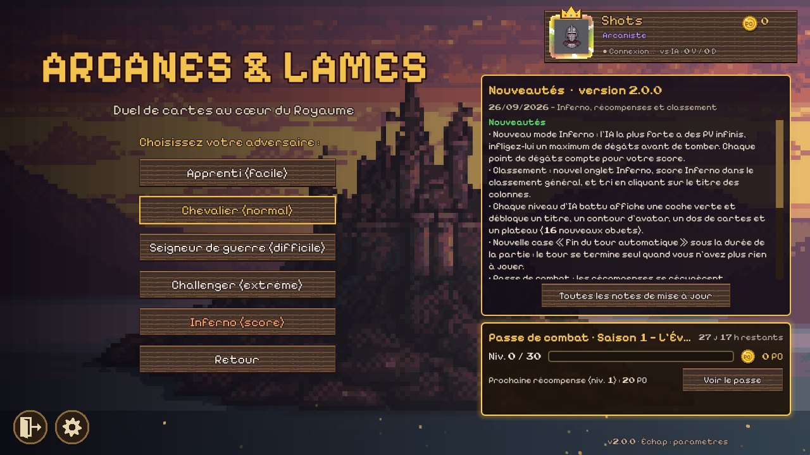
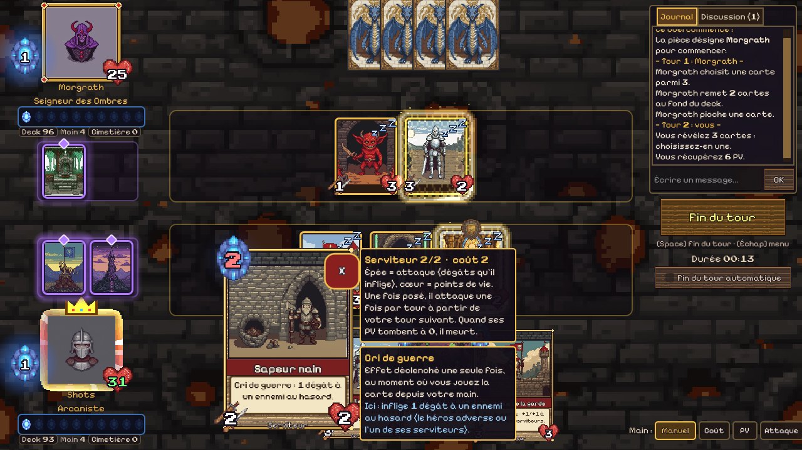
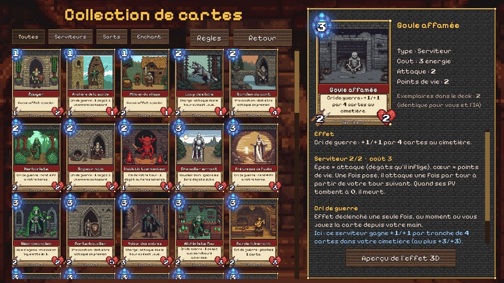
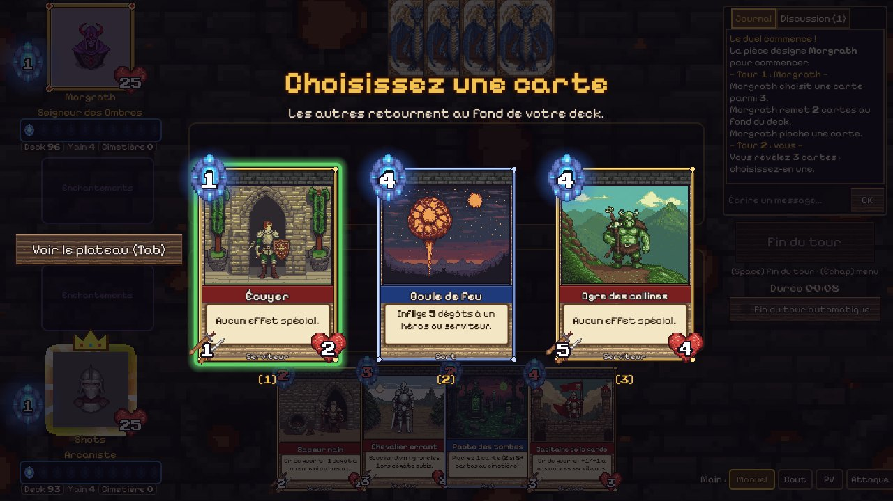
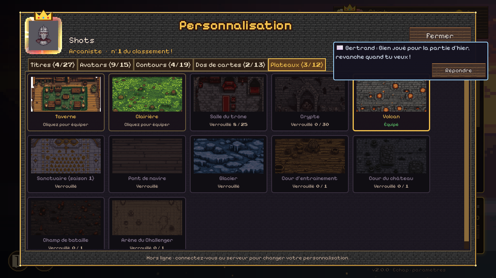
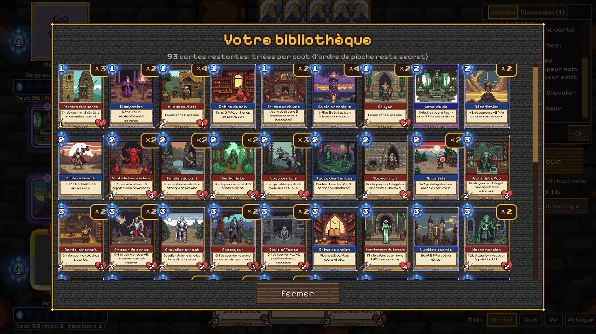

# Arcanes & Lames

A turn-based 2D card game inspired by Hearthstone, set in a medieval-fantasy world in 8-bit pixel art, with 3D visual effects for card abilities. Built with **Godot 4.7**. Single-player against four AI levels, plus online play through a small Python community server (accounts, lobby, friends, leaderboard, replays).

> The game is written in French and translated into English, German, Spanish, Italian and Portuguese.

## Screenshots

*Captured with a local demo profile ("Shots"); the chat message is sample content.*

| Main menu | Battle |
| --- | --- |
|  |  |

| Card collection | Draw choice |
| --- | --- |
|  |  |

| Customisation | Library |
| --- | --- |
|  |  |

## Run the game

Open the folder in Godot 4.7 and press **F5** (main scene: `scenes/main_menu.tscn`).

## Content

| Screen | Description |
|---|---|
| Boot | Version check and automatic update |
| Main menu | Play vs AI, Multiplayer, Collection, Leaderboard, Friends, Rules, Settings, profile badge, patch notes, battle pass |
| Collection | All cards, filters, detailed explanations, keywords, **3D effect preview** |
| Battle | Board, hand (manual / cost / HP / attack sorting, two-click play), mouse targeting, clock, log + chat, 3D effects, online rematch |
| Esc (anywhere) | Profile (name, avatar, customisation), Audio, Display, Game, Key bindings, Rules |
| Multiplayer | Create a game or join the list of open games, friend invitations |
| Customisation | Titles, avatars, avatar frames, card backs and boards to unlock (`data/cosmetics.json`) |
| Statistics, profiles, replays | Global stats, public player profiles, match history and replays |
| Messages | Private messages between friends |

### Rules (summary)

- Heroes start with 25 HP **with no maximum**; a coin toss decides who starts; **energy**: 1 on the first turn, +1 per turn (max 10), refilled every turn.
- Both sides play **the same 100-card deck** (59 different cards, 1–4 copies each, shuffled differently).
- **Draw choice**: at the start of your turn, reveal 3 cards, keep one, the other two go to the bottom of the deck.
- **Enchantments** (max 2 per player): permanent or per-turn effects, removed only by destruction cards.
- Minions with continuous effects (auras, start / end of turn), graveyard synergies, deck-altering cards.
- AI levels: Apprentice, Knight, Warlord (simulates its moves and the opponent's turn), Challenger, plus an **Inferno** score mode.
- Keywords: Taunt, Charge, Divine Shield, Battlecry, Deathrattle, Continuous effect. Full rules in the game (main menu › Rules).

## Multiplayer

All online games are **relayed by the server**: players never open a port. The host is authoritative; both clients run the same deterministic simulation (`GameState`, same random seed) and only exchange actions and chat.

### Running a server

```bash
python server/lobby_server.py        # Python 3.9+, or server/lancer_serveur.bat on Windows
```

It listens on TCP 7778 (game) and 7779 (HTTP: version check, updates and download page); TLS is available on 7780 when a certificate is configured. Point the game to it from **Esc › Profile**.

### Official server configuration

The address of your official server is **not stored in the repository**:

- `official_server.cfg` (copy `official_server.cfg.example`) — read by the game at startup (address, web URL, TLS host name) and included in exports. Without it, the game targets a local server in plain TCP.
- `local_config.json` (copy `local_config.example.json`) — used by the publishing tools (public web URL, path to Godot).
- `server/local_config.json` (copy `server/local_config.example.json`, or set `ARCANES_WEB_BASE`) — public web URL the server shows on its download page. `tools/deploy_server.py` generates and installs it next to the deployed server from `local_config.json`.

`tools/publish_update.py` refuses to publish a version when these files are missing.

### Security and anti-cheat

- **Verified games**: the server issues a ticket (seed, first player) at the start of each game and **replays** the game at the end with the game engine in headless mode (`scenes/tools/verifier.tscn`, `scripts/core/match_check.gd`). Rewards, stats and history are only granted to validated games.
- Online, the server records relayed actions, enforces the ticket's seed and the account's identity; leaving a game counts as a loss.
- Rate limits per connection and per IP.
- **Signed updates**: `latest.json` is signed (RSA 3072, SHA-256) by `tools/publish_update.py`; the public key is embedded in `scripts/autoload/updater.gd`, so even a compromised server cannot push a fake package.
- Known limitation: each client knows the game seed (local simulation), so a modified client could see the opponent's hand.

## Updates

At launch the boot screen asks the server for the current version. Outdated clients get a *New version available* screen with the patch notes and an **Update** button (the `.pck` package is downloaded, its SHA-256 checked, and the game restarts on it) or can play offline. The server refuses clients older than the published version.

To publish a version: `python tools/publish_update.py 1.1.0 "Release notes…"` (or `tools/publier_mise_a_jour.bat`). It sets the version, exports Windows / Linux / macOS / Android builds, signs the Windows executable, builds the update packages, the full downloads and the signed `latest.json`, then uploads everything. `--local` prepares everything without uploading. Add the version's entry to `data/patchnotes.json` first.

## Languages

French is the source language and the translation key; translations live in `data/i18n/<lang>.json`, loaded by `scripts/core/loc.gd` (`Loc.t("…")`). `python tools/i18n_extract.py --missing` lists missing strings and `python tools/i18n_check.py <lang>` checks placeholders and BBCode tags.

## Assets generated with ComfyUI

All graphics, music and sound effects were generated with ComfyUI:

| Type | Workflow (`tools/comfy_workflows/`) | Models |
|---|---|---|
| Illustrations, backgrounds, UI textures | `pixel_art_image.json` | SDXL base 1.0 + pixel-art-xl LoRA |
| Icons / cut-out sprites | `pixel_art_sprite_nobg.json` | same + BiRefNet |
| Chiptune music | `chiptune_music.json` | ACE-Step 1.5 turbo |
| 8-bit sound effects | `retro_sfx.json` | Stable Audio Open 1.0 + T5 base |

Prompts, sizes and seeds are in `tools/assets_manifest.json`; `tools/postprocess_assets.py` reduces the images to true pixel art and composes the UI elements. Fonts: Pixelify Sans and Press Start 2P (OFL, `assets/fonts/OFL.txt`).

## 3D effects

`scripts/fx/fx_3d.gd` overlays a transparent 3D `SubViewport` on the 2D game with a perspective camera aligned to the screen: fireball, lightning, healing, blessing, frost storm, arrows, summoning, dragon breath, divine shield, flying cards, menu embers, fireworks.

## Tests

- `godot --headless --path . res://tests/sim_test.tscn` — 200 AI-vs-AI games + determinism check.
- Automated network test (server running on 7778), two headless instances:

  ```
  godot --headless --path . -- --profile=a --name=Guest --autoplay --auto-accept --quit-after-game
  godot --headless --path . -- --profile=b --name=Host --autoplay --auto-host=Guest --quit-after-game
  ```

- `--profile=X` also lets you run two instances on the same machine by hand.

## Project structure

```
scenes/            boot (updates), main_menu, battle, collection, multiplayer
scripts/autoload/  settings, updater, audio, card_db (cards + deck), ui_theme, lobby (server), net, pause_menu
scripts/core/      game_state (rules), ai, match_check (verification), loc (i18n)
scripts/ui/        card, minion and hero views, panels
scripts/fx/        fx_3d (3D effects)
server/            Python community server
tools/             ComfyUI workflows, post-processing, i18n, publishing and deployment scripts
data/              cosmetics, patch notes, translations
```
